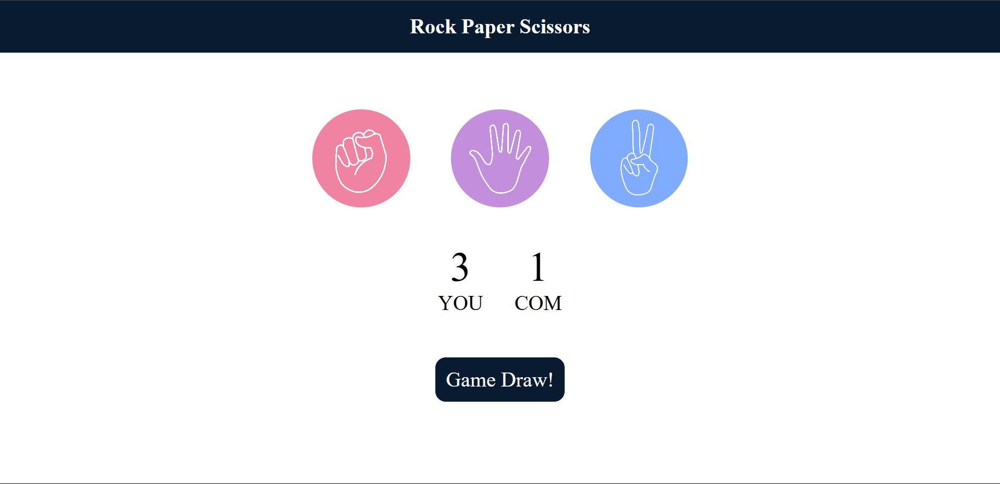

# Rock Paper Scissors Game

This is a simple **Rock Paper Scissors** game built using **HTML**, **CSS**, and **JavaScript**. It allows the user to play against the computer by selecting rock, paper, or scissors, and the result is displayed along with the updated scores.

## Features

- User can choose between **Rock**, **Paper**, or **Scissors**.
- The computer makes a random choice.
- The game determines the winner and displays the result (Win, Lose, or Draw).
- The user and computer scores are updated in real-time.
- The interface is interactive with smooth transitions and hover effects.

## 📸 Picture of the Game

## Technologies Used

- **HTML**: Structure of the game interface.
- **CSS**: Styling for the game layout and user interactions.
- **JavaScript**: Logic for game functionality, random computer choice, and score updates.

## How to Play

1. Click on any of the three icons: Rock, Paper, or Scissors.
2. The computer will randomly select its choice.
3. The game will compare the user's choice with the computer's and display the result:
   - **You Win!** if your choice beats the computer's.
   - **You Lose!** if the computer's choice beats yours.
   - **Game Draw!** if both choices are the same.
4. The scores for both the user and the computer will be updated after each round.
